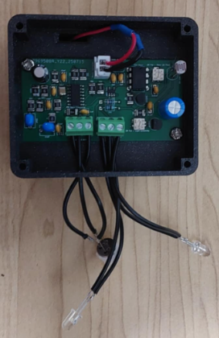

## Energy-Efficient Night-Light with Motion and Ambient-Light Detection

# Description
A simple and affordable motion-activated LED circuit designed for environments where activation should depend on both motion and ambient light levels. The circuit uses a PIR motion sensor and a light-dependent resistor (LDR) to allow users to define the lighting conditions under which motion will trigger the LED. Two onboard potentiometers independently adjust: (1) the environmental light threshold (from full daylight to complete darkness) and (2) the LED on-time delay (0 – 72 seconds). The design is entirely analog, requiring no microcontroller, programming, or complex setup, making it easy to replicate and modify. The circuit is open source under GNU GPL 3.0 and may be freely used, modified, and shared.

# Overview
The system operates by combining PIR motion detection with ambient light sensing. The LDR and potentiometer form an adjustable voltage divider that biases a transistor, determining whether motion detection is enabled based on current light conditions. A TLV8544 low-power comparator stage processes the sensor signals and feeds them into a SN74LVC1G00 NAND gate for signal inversion and logic control before triggering a 555 timer configured in monostable mode. The second potentiometer adjusts the RC time constant of the 555 timer, allowing precise control over the LED on-time from near-instant to over one minute.

Most of the circuit is built with through-hole components for ease of assembly, modification, and long-term serviceability. The PIR sensor section, however, is a compact, self-contained module using mostly SMD components, as it continuously processes and conditions the sensor output — a task that benefits from a smaller, integrated, and more energy-efficient layout.

A series of resistors and filtering capacitors ensure noise immunity and stable operation even in fluctuating lighting or high-EMI environments. Bulk decoupling capacitors stabilize the 6 V nominal supply for reliable performance.

Unlike microcontroller-based solutions, this analog approach offers instant startup, minimal standby current, and long-term reliability without software maintenance. Potential applications include indoor lighting control, battery-powered motion lamps, and outdoor security lights with dusk-to-dawn control.

# Assembly & Modification
All necessary PCB design files, schematics, and a complete Bill of Materials (BOM) are included. Users can order parts directly from the BOM and have the PCB fabricated using the provided Gerber files. The prototype was entirely hand-soldered, using a mix of wire solder for through-hole components and solder paste for select SMD parts in the PIR section. The board includes outputs for two LEDs, allowing for multiple lighting configurations. Since all PCB design files are provided, users are free to modify layouts, adjust footprints, or expand the design for their own applications.

# Enclosure & Use Case
An enclosure design is included, sized to house the PCB and powered by four AAA batteries. In the reference build, this enclosure was used for an indoor novelty night light, shaped like a cat ornament, where the LEDs served as the cat’s eyes

